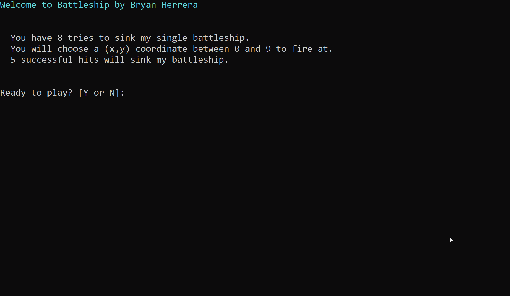

# Battleship Console App

*A virtual version of the classic battleship board game.*

## Summary

The goal of this application is to get familiar with C# .NET framework. I learned how to create variables, arrays, and how to get user input in C#. This was a great challenge to see how quickly I can get up to speed learning a new language and building an application.

## Author

* **Bryan Herrera** - *Full-Stack Developer* - [Website](http://bryan-herrera.com) | [LinkedIn](https://www.linkedin.com/in/herrerabryan/)  